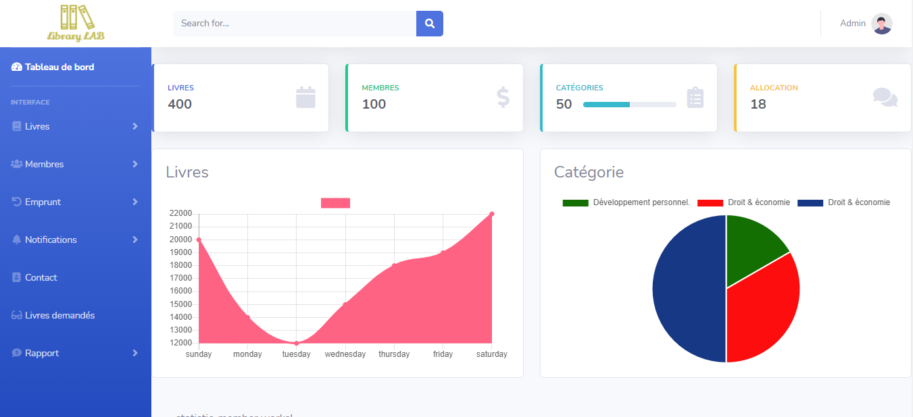

## Introduction

Library lab is a web application for managing a library by making it easier to borrow catalogItems from readers. This application is a virtual version of a real bookstore.

## Informations

- Status: under development
- Lastest version 1.0
- Sector: finance
- Created: December 2020
- Last updated: December 2020

## Table of contents

- [Documentation](#general-info)
- [Demo](#demo)
- [Screenshots](#screenshots)
- [Technologies](#technologies)
- [Setup](#setup)
- [Features](#features)
- [Status](#status)
- [Contact](#contact)
- [License](#license)

## Documentation

https://github.com/aniskchaou/LIBRARYLAB-FRONTEND-ADMIN/wiki

## Demo

https://library-lab.herokuapp.com/

## Screenshots

## Technologies

- Spring boot
- Angular

## Setup

## Features

-

## Contact

contact@delta-dev-software.com

## License

<a href="license.txt">MIT License</a>
